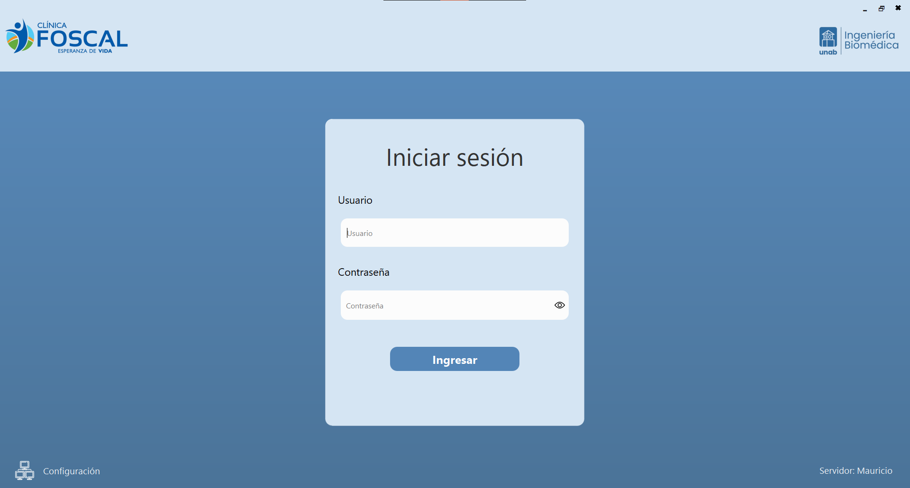
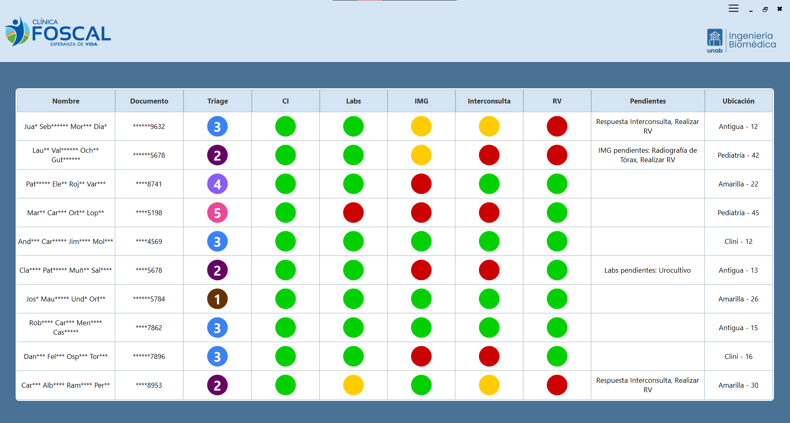
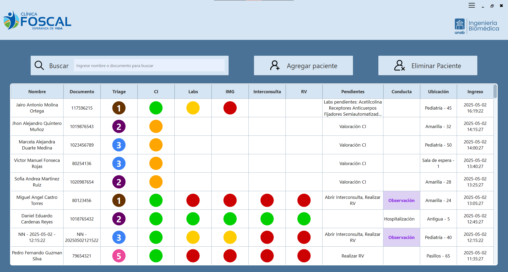
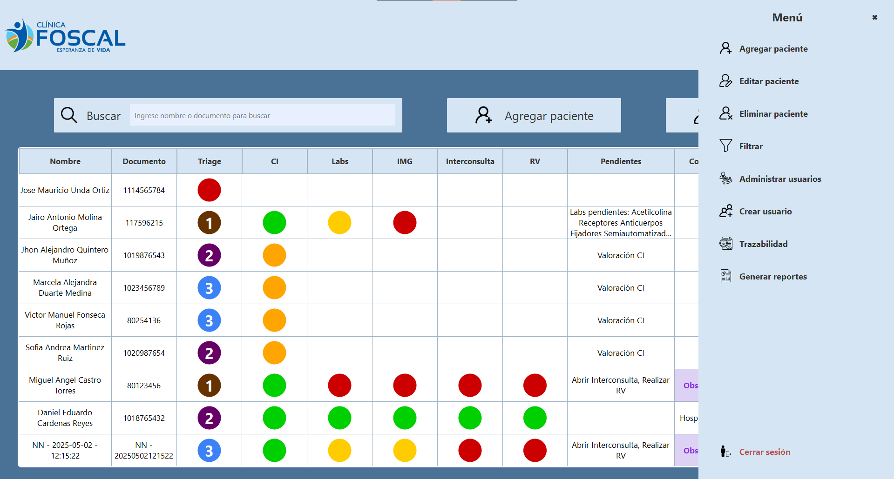
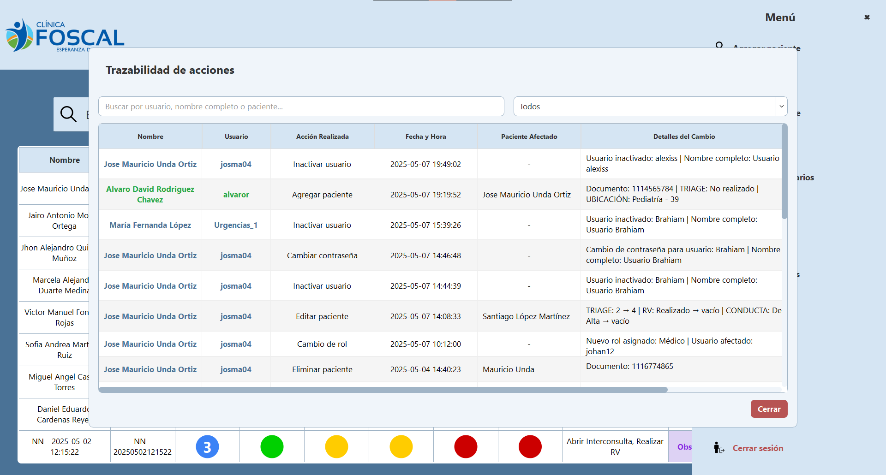
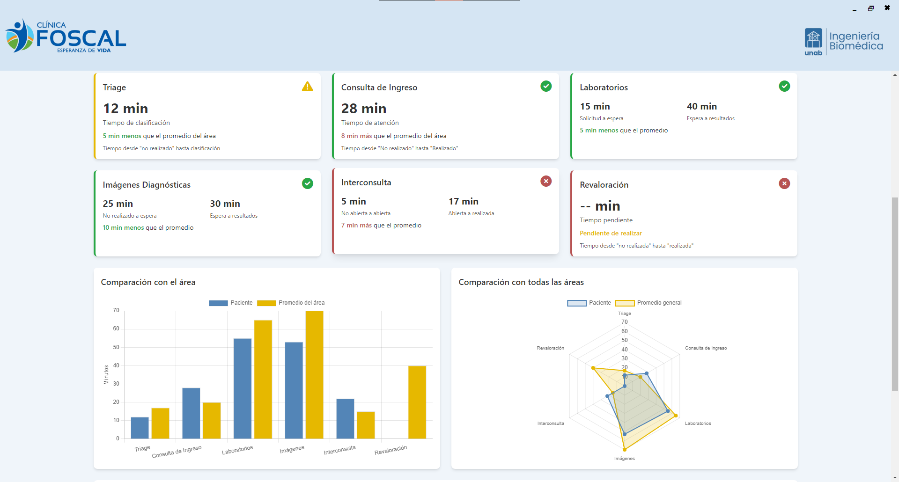
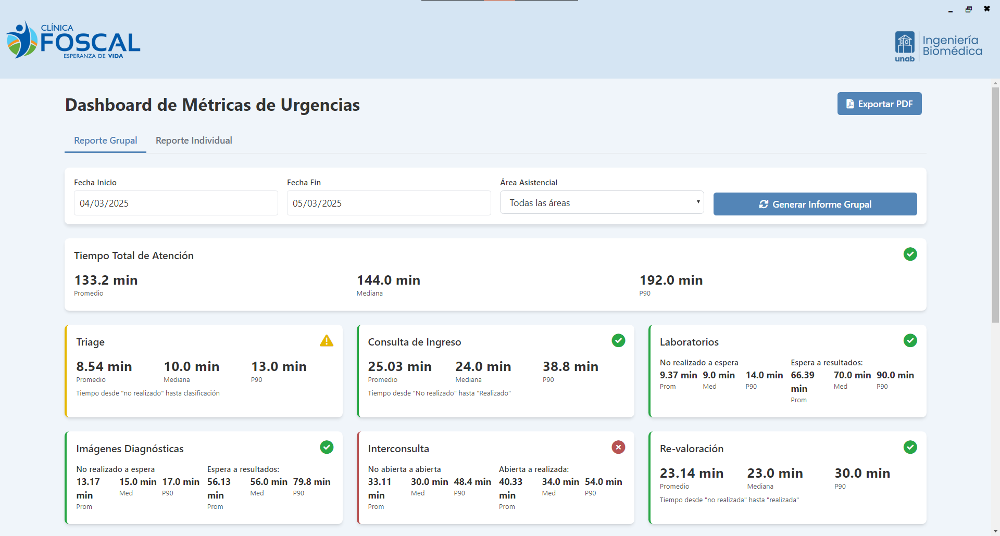
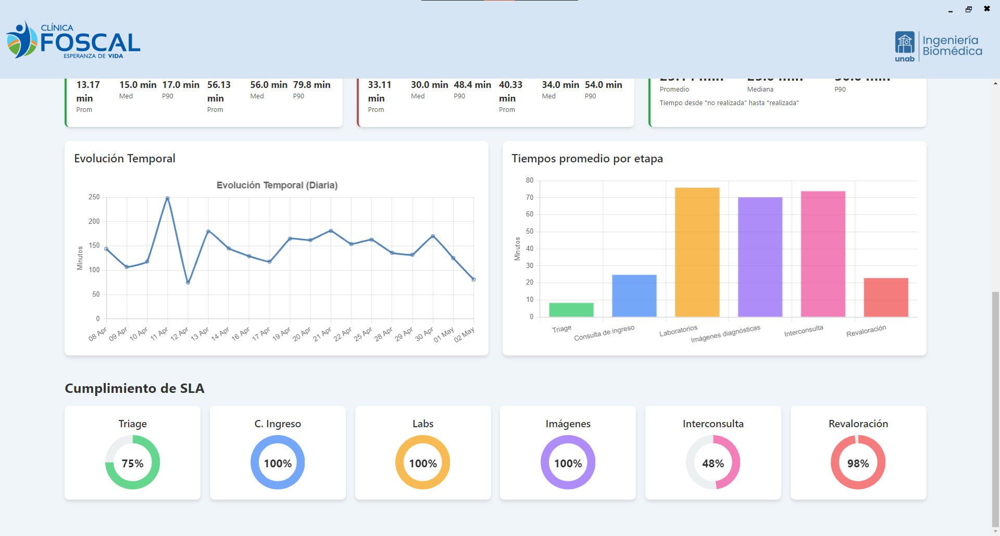

# Sistema de Visualización de Urgencias - FOSCAL

<div align="center">



[](https://www.python.org/)
[](https://www.riverbankcomputing.com/software/pyqt/)
[![MySQL]### Visitante (Solo Lectura)
| Funcionalidad | Acceso |
|---------------|--------|
| Ver pacientes en sala de espera | ✅ |
| Actualización automática | ✅ |
| Editar información | ❌ |
| Generar reportes | ❌ |
| Gestionar usuarios | ❌ |

### Médico (Lectura y Escritura)mg.shields.io/badge/MySQL-Database-orange.svg)](https://www.mysql.com/)
[](LICENSE.md)

**Sistema integral de gestión y visualización de pacientes en tiempo real para servicios de urgencias**

[Características](#características-principales) • [Instalación](#instalación) • [Uso](#uso) • [Interfaces](#interfaces-del-sistema) • [Documentación](#documentación)

</div>

---

## Tabla de Contenidos

- [Descripción General](#descripción-general)
- [Características Principales](#características-principales)
- [Requisitos del Sistema](#requisitos-del-sistema)
- [Instalación](#instalación)
- [Configuración](#configuración)
- [Uso](#uso)
- [Interfaces del Sistema](#interfaces-del-sistema)
- [Roles y Permisos](#roles-y-permisos)
- [Funcionalidades Detalladas](#funcionalidades-detalladas)
- [Arquitectura del Proyecto](#arquitectura-del-proyecto)
- [Generación de Reportes](#generación-de-reportes)
- [Construcción del Ejecutable](#construcción-del-ejecutable)
- [Base de Datos](#base-de-datos)
- [Contribución](#contribución)
- [Licencia](#licencia)
- [Autores](#autores)

---

## Descripción General

El **Sistema de Visualización de Urgencias** es una aplicación de escritorio desarrollada como proyecto de grado para la **Universidad Autónoma de Bucaramanga (UNAB)**. Este sistema está diseñado específicamente para optimizar la gestión y visualización en tiempo real de pacientes en servicios de urgencias hospitalarias, con especial énfasis en la **Fundación Oftalmológica de Santander - Clínica Carlos Ardila Lülle (FOSCAL)**.

### Problema que Resuelve

En los servicios de urgencias, el personal médico y administrativo necesita:
- **Visibilidad inmediata** del estado de todos los pacientes
- **Seguimiento eficiente** de tiempos de espera y atención
- **Trazabilidad completa** de la atención médica
- **Métricas precisas** para la toma de decisiones
- **Gestión centralizada** de usuarios y permisos

### Solución Implementada

Este sistema proporciona una plataforma centralizada que permite:
- Visualización en tiempo real del flujo de pacientes
- Clasificación por áreas y niveles de triage
- Seguimiento de pruebas diagnósticas (laboratorios e imágenes)
- Generación automática de reportes estadísticos
- Sistema de autenticación multinivel
- Interfaz responsiva y personalizable por usuario

---

## Características Principales

### Sistema de Autenticación
- Autenticación segura con MySQL
- Tres niveles de acceso: **Visitante**, **Médico** y **Administrador**
- Gestión de permisos basada en roles
- Cifrado de contraseñas

### Visualización en Tiempo Real
- Vista de sala de espera con actualización automática
- Clasificación de pacientes por triage (1-5)
- Indicadores visuales de estado (CI, Labs, IMG, Interconsultas)
- Modo presentación con rotación automática de páginas

### Gestión de Pacientes
- CRUD completo de información de pacientes
- Historial de transiciones de estado
- Trazabilidad detallada de atención médica
- Filtrado avanzado por múltiples criterios

### Métricas y Análisis
- Cálculo automático de tiempos de espera
- Estadísticas por áreas y periodos
- Percentiles (P50, P90) y promedios
- Comparación temporal de métricas

### Generación de Reportes
- Reportes individuales por paciente
- Reportes grupales por periodo
- Exportación a PDF con gráficos
- Diseño profesional y personalizable

### Administración de Usuarios
- Creación y gestión de usuarios del sistema
- Asignación de roles y permisos
- Cambio de contraseñas
- Auditoría de accesos

### Personalización
- Preferencias por usuario
- Filtros de áreas personalizables
- Configuración de tiempos de actualización
- Temas visuales adaptables

---

## Requisitos del Sistema

### Hardware Mínimo
- **Procesador:** Intel Core i3 o equivalente
- **RAM:** 4 GB
- **Almacenamiento:** 500 MB disponibles
- **Pantalla:** Resolución mínima 1366x768

### Hardware Recomendado
- **Procesador:** Intel Core i5 o superior
- **RAM:** 8 GB o más
- **Almacenamiento:** 1 GB disponibles
- **Pantalla:** Resolución Full HD (1920x1080) o superior

### Software
- **Sistema Operativo:** Windows 10/11 (64-bit)
- **Python:** 3.13+ (para desarrollo)
- **MySQL Server:** 5.7+ o 8.0+
- **Conexión de red:** Acceso al servidor de base de datos

---

## Instalación

### Opción 1: Ejecutable Pre-compilado (Usuarios Finales)

1. **Descargar el ejecutable** desde la carpeta `Ejecutable/`:
   ```
   Sistema_Visualizacion.exe
   ```

2. **Copiar el archivo de configuración:**
   - Asegúrese de tener `config.ini` en la misma carpeta que el ejecutable

3. **Ejecutar el programa:**
   - Doble clic en `Sistema_Visualizacion.exe`
   - Se abrirá la ventana de inicio de sesión

### Opción 2: Instalación desde Código Fuente (Desarrolladores)

1. **Clonar el repositorio:**
   ```bash
   git clone https://github.com/junda05/Sistema-Urgencias.git
   cd Sistema-Urgencias
   ```

2. **Crear un entorno virtual:**
   ```bash
   python -m venv venv
   ```

3. **Activar el entorno virtual:**
   - **Windows:**
     ```bash
     venv\Scripts\activate
     ```
   - **Linux/Mac:**
     ```bash
     source venv/bin/activate
     ```

4. **Instalar dependencias:**
   ```bash
   pip install -r requirements.txt
   ```

   **Dependencias principales:**
   - PyQt5 >= 5.15.0
   - PyMySQL >= 1.0.2
   - numpy >= 1.24.0
   - matplotlib >= 3.7.0
   - reportlab >= 4.0.0
   - jinja2 >= 3.1.0

5. **Ejecutar el programa:**
   ```bash
   python Código_Principal.py
   ```

---

## Configuración

### Archivo de Configuración (`config.ini`)

Edite el archivo `config.ini` en la raíz del proyecto:

```ini
[DATABASE]
host = 192.168.130.253    # IP del servidor MySQL

[ADMIN]
user = Urgencias_1         # Usuario administrador de MySQL
password = Josma@0409      # Contraseña del administrador
```

### Base de Datos

1. **Importar el esquema de base de datos:**
   ```bash
   mysql -u root -p < "Base de datos/DB_Software.sql"
   ```

2. **Verificar la conexión:**
   - El sistema verificará automáticamente la conexión al iniciar
   - Si hay problemas, revise la configuración en `config.ini`

### Estructura de la Base de Datos

El sistema utiliza el esquema `sistema_visualizacion` con las siguientes tablas principales:
- `pacientes` - Información y estado actual de pacientes
- `usuarios_sistema` - Usuarios con acceso al sistema
- `preferencias_usuario` - Configuraciones personalizadas
- `historial_transiciones` - Auditoría de cambios de estado
- `metricas_temporales` - Estadísticas calculadas

---

## Uso

### Inicio de Sesión


1. **Abrir la aplicación**
2. **Ingresar credenciales:**
   - Usuario
   - Contraseña
3. **Hacer clic en "Iniciar Sesión"**

**Usuarios de Prueba:**
- **Administrador:** `Urgencias_1` / `Josma@0409`
- **Médico:** Configurado por el administrador
- **Visitante:** Configurado por el administrador

### Navegación General

- **Menú Lateral:** Acceso a todas las funcionalidades según el rol
- **Header Superior:** Información del usuario, fecha/hora, cerrar sesión
- **Tabla Principal:** Visualización de pacientes en tiempo real
- **Barra de Búsqueda:** Filtrado rápido por nombre o documento
- **Botones de Acción:** Agregar, editar, eliminar, filtrar, etc.

---

## Interfaces del Sistema

### 1. Vista de Visitante (Sala de Espera)



**Características:**
- Visualización de pacientes en espera
- Información básica: nombre, triage, ubicación
- Actualización automática cada N segundos
- Modo presentación con paginación automática
- **Solo lectura** - Sin opciones de edición

**Funcionalidades:**
- Actualización automática
- Navegación por páginas
- Filtrado por área
- Modo pantalla completa

### 2. Vista de Médico


**Características:**
- Acceso completo a información de pacientes
- Edición de estados y conductas
- Visualización de trazabilidad
- Generación de reportes individuales



**Funcionalidades:**
- Editar información de pacientes
- Ver métricas individuales
- Trazabilidad completa
- Generar reportes
- Notificaciones de cambios críticos

### 3. Vista de Administrador



**Características:**
- Todas las funcionalidades de médico
- Gestión de usuarios del sistema
- Acceso a métricas globales
- Configuración de sistema



**Funcionalidades Exclusivas:**
- Gestión de usuarios
- Asignación de permisos
- Métricas y análisis avanzados
- Configuración del sistema
- Reportes grupales

---

## Roles y Permisos

### Visitante (Solo Lectura)
| Funcionalidad | Acceso |
|---------------|--------|
| Ver pacientes en sala de espera | ✅ |
| Actualización automática | ✅ |
| Editar información | ❌ |
| Generar reportes | ❌ |
| Gestionar usuarios | ❌ |

### Médico (Lectura y Escritura)
| Funcionalidad | Acceso |
|---------------|--------|
| Ver todos los pacientes | ✅ |
| Editar información de pacientes | ✅ |
| Ver trazabilidad | ✅ |
| Generar reportes individuales | ✅ |
| Filtros avanzados | ✅ |
| Gestionar usuarios | ❌ |
| Reportes grupales | ❌ |

### Administrador (Control Total)
| Funcionalidad | Acceso |
|---------------|--------|
| Todas las funciones de médico | ✅ |
| Crear/editar/eliminar usuarios | ✅ |
| Asignar roles y permisos | ✅ |
| Generar reportes grupales | ✅ |
| Ver métricas globales | ✅ |
| Configurar sistema | ✅ |
| Auditoría completa | ✅ |

---

## Funcionalidades Detalladas

### Sistema de Triage

El sistema utiliza la clasificación internacional de triage:

| Nivel | Color | Descripción | Tiempo de Atención |
|-------|-------|-------------|-------------------|
| 1 | 🔴 Rojo | Resucitación | Inmediato |
| 2 | 🟠 Naranja | Emergencia | < 15 minutos |
| 3 | 🟡 Amarillo | Urgente | < 30 minutos |
| 4 | 🟢 Verde | Menos urgente | < 60 minutos |
| 5 | 🔵 Azul | No urgente | < 120 minutos |

### Trazabilidad de Pacientes

**Registro automático de:**
- Timestamp de cada cambio
- Usuario que realizó la modificación
- Campos modificados (antes/después)
- Transiciones de ubicación
- Cambios en conducta médica
- Actualización de estudios (Labs, IMG)

**Visualización:**
- Timeline cronológico de eventos
- Detalles completos de cada transición
- Filtrado por tipo de evento
- Exportación de historial

### Generación de Reportes

#### Reporte Individual





**Contenido:**
- Información demográfica del paciente
- Historial completo de atención
- Métricas de tiempos de espera
- Estudios realizados
- Evolución del triage
- Conducta médica final

#### Reporte Grupal




**Contenido:**
- Estadísticas del periodo seleccionado
- Distribución por triage
- Tiempos promedio de atención
- Análisis por áreas
- Gráficos comparativos
- Métricas P50 y P90
- Tendencias temporales

**Formatos de Exportación:**
- PDF con diseño profesional
- Gráficos incluidos
- Periodo personalizable
- Branding institucional

### Sistema de Alertas

**Alertas Automáticas:**
- Pacientes con tiempos de espera críticos
- Triage de emergencia sin atender
- Conductas pendientes por más de X horas
- Estudios críticos sin resultados

### Preferencias de Usuario

**Configurables por cada usuario:**
- Filtros de área predeterminados
- Tiempo de actualización automática
- Filas por página en tablas
- Preferencias de visualización
- Configuración de notificaciones

**Persistencia:**
- Guardado automático en base de datos
- Sincronización entre sesiones
- Respaldo en archivos JSON locales

---

## Arquitectura del Proyecto

```
Sistema-Urgencias/
├── Código_Principal.py          # Punto de entrada de la aplicación
├── config.ini                   # Configuración de base de datos
├── build_exe.py                 # Script para generar ejecutable
├── LICENSE.md                   # Licencia académica
├── README.md                    # Este archivo
│
├── Back_end/                    # Lógica de negocio y modelos
│   ├── Manejo_DB.py            # Gestión de conexión a BD
│   ├── ModeloMetricas.py       # Cálculo de estadísticas
│   ├── MetricsTest.py          # Pruebas de métricas
│   └── Usuarios/               # Modelos de usuario
│       ├── ModeloAutenticacion.py
│       ├── ModeloUsuarios.py
│       ├── ModeloPreferencias.py
│       └── ModeloSalaEspera.py
│
├── Front_end/                   # Interfaz gráfica
│   ├── login_interface.py      # Ventana de inicio de sesión
│   ├── sala_espera.py          # Vista de visitante
│   ├── doctors.py              # Vista de médico
│   ├── admin.py                # Vista de administrador
│   │
│   ├── styles/                 # Componentes y estilos
│   │   ├── styles.py           # Estilos globales
│   │   ├── components.py       # Componentes reutilizables
│   │   ├── animation_components.py
│   │   ├── table_components.py
│   │   ├── header_components.py
│   │   ├── lateral_menu.py
│   │   ├── custom_widgets.py
│   │   ├── input_components.py
│   │   ├── dialog_components.py
│   │   ├── user_components.py
│   │   ├── traceability_dialog.py
│   │   ├── report_generator.py
│   │   ├── exportar_pdf.py
│   │   ├── font_utils.py
│   │   └── Frontend_utils.py
│   │
│   └── imagenes/               # Recursos gráficos
│       ├── logo_foscal.png
│       ├── logo.png
│       └── ... (iconos y elementos UI)
│
├── Base de datos/               # Scripts de BD
│   ├── DB_Software.sql         # Esquema completo
│   ├── ixs_part1.py            # Importación de datos
│   ├── ixs_part2.py
│   ├── labs.py
│   └── *.xlsx                  # Datos de prueba
│
├── templates/                   # Plantillas de reportes
│   ├── report.html             # Plantilla HTML
│   ├── styles.css              # Estilos para reportes
│   └── script.js               # Scripts para reportes
│
├── preferencias/                # Preferencias de usuario (JSON)
├── Informes/                    # Reportes generados (PDF)
├── images/                      # Capturas de pantalla
└── Ejecutable/                  # Versión compilada
    ├── Sistema_Visualizacion.exe
    └── config.ini
```

---

## Construcción del Ejecutable

Para generar el ejecutable de la aplicación:

### Requisitos Previos
```bash
pip install pyinstaller
```

### Proceso de Compilación

1. **Verificar configuración:**
   - Asegúrese de que `build_exe.py` esté configurado correctamente
   - Verifique que todas las rutas de recursos sean correctas

2. **Ejecutar el script de compilación:**
   ```bash
   python build_exe.py
   ```

3. **Ubicar el ejecutable:**
   - El archivo `.exe` se generará en la carpeta `dist/`
   - Copiar a la carpeta `Ejecutable/` junto con `config.ini`

### Características del Ejecutable

- Un solo archivo - Toda la aplicación en un `.exe`
- Sin consola - Interfaz gráfica limpia
- Recursos incluidos - Imágenes y estilos embebidos
- Icono personalizado - Logo de la aplicación
- Optimizado - Compresión UPX activada

### Configuración en `build_exe.py`

```python
# Argumentos principales
--name=Sistema_Visualizacion    # Nombre del ejecutable
--onefile                        # Archivo único
--windowed                       # Sin consola
--icon=logo.png                  # Icono de la aplicación
--add-data                       # Incluir recursos
```

---

## Base de Datos

### Esquema Principal: `sistema_visualizacion`

#### Tablas Principales

**`pacientes`**
- Información demográfica y clínica
- Estado actual del paciente
- Ubicación y triage
- Timestamps de eventos

**`usuarios_sistema`**
- Credenciales de acceso
- Roles y permisos
- Información de contacto

**`preferencias_usuario`**
- Configuraciones personalizadas
- Filtros guardados
- Opciones de visualización

**`historial_transiciones`**
- Auditoría de cambios
- Timeline de eventos
- Usuario responsable de cada cambio

**`metricas_temporales`**
- Estadísticas precalculadas
- Optimización de consultas
- Datos históricos

### Conexión a la Base de Datos

El sistema utiliza **PyMySQL** para la conexión:

```python
# Configuración en Back_end/Manejo_DB.py
import pymysql

conn = pymysql.connect(
    host='192.168.130.253',
    user='usuario',
    password='contraseña',
    database='sistema_visualizacion'
)
```

### Respaldo y Mantenimiento

**Respaldo de Base de Datos:**
```bash
mysqldump -u root -p sistema_visualizacion > backup.sql
```

**Restauración:**
```bash
mysql -u root -p sistema_visualizacion < backup.sql
```

---

## Contribución

Este es un proyecto académico desarrollado como trabajo de grado. Si desea contribuir o usar el código:

### Lineamientos

1. **Fork** el repositorio
2. Crear una **rama** para tu feature (`git checkout -b feature/AmazingFeature`)
3. **Commit** tus cambios (`git commit -m 'Add some AmazingFeature'`)
4. **Push** a la rama (`git push origin feature/AmazingFeature`)
5. Abrir un **Pull Request**

### Estándares de Código

- **PEP 8** para código Python
- **Documentación** clara en docstrings
- **Comentarios** en español para el proyecto
- **Type hints** donde sea posible
- **Pruebas unitarias** para nuevas funcionalidades

---

## Licencia

Este software fue desarrollado como **proyecto de grado** en la **Universidad Autónoma de Bucaramanga (UNAB)**.

### Términos de Uso

- Uso con **fines de revisión académica**
- Estudio y referencia educativa
- **Requiere autorización expresa** para cualquier otro uso
- Uso comercial sin autorización

Para más información, consulte el archivo [LICENSE.md](LICENSE.md).

---

## Autores

**Proyecto de Grado - Universidad Autónoma de Bucaramanga**

### Desarrollador Principal
- **Estudiante:** José Mauricio Unda Ortiz
- **Programa:** Ingeniería Biomédica
- **Semestre:** Graduado
- **Año:** 2024-2025

### Director de Proyecto
- **Nombre:** [Nombre del Director]
- **Cargo:** [Cargo]

### Institución Colaboradora
- **Fundación Oftalmológica de Santander**
- **Clínica Carlos Ardila Lülle (FOSCAL)**

---

## Contacto y Soporte

### Repositorio
- **GitHub:** [https://github.com/junda05/Sistema-Urgencias](https://github.com/junda05/Sistema-Urgencias)

### Reportar Problemas
Si encuentra algún error o tiene sugerencias:
1. Abra un **Issue** en GitHub
2. Describa el problema detalladamente
3. Incluya capturas de pantalla si es posible
4. Especifique su sistema operativo y versión de Python

### Documentación Adicional
- **Wiki del Proyecto:** [En construcción]
- **Presentación del Proyecto:** [Disponible próximamente]
- **Video Demostrativo:** [Disponible próximamente]

---

## Agradecimientos

- **Universidad Autónoma de Bucaramanga (UNAB)** por el apoyo académico
- **FOSCAL** por proporcionar el caso de uso real
- **Comunidad de PyQt5** por la excelente documentación
- Todos los profesores y mentores que guiaron este proyecto

---

## Estadísticas del Proyecto

- **Líneas de código:** ~28,000+
- **Archivos Python:** 112+
- **Módulos principales:** 7
- **Tiempo de desarrollo:** Abril 2024 - Mayo 2025
- **Versión actual:** Beta Final

---

<div align="center">

**Desarrollado con dedicación para mejorar la atención en servicios de urgencias**


**Sistema de Visualización de Urgencias - FOSCAL © 2025**

</div>
